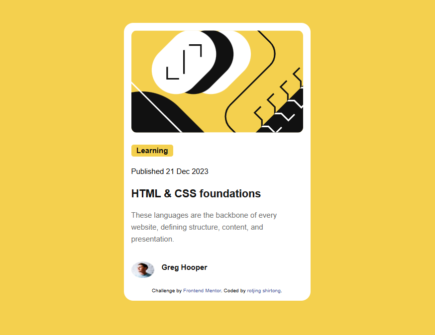

# Frontend Mentor - Blog preview card solution

This is a solution to the [Blog preview card challenge on Frontend Mentor](https://www.frontendmentor.io/challenges/blog-preview-card-ckPaj01IcS). 

## Table of contents
  - [The challenge](#the-challenge)
  - [Screenshot](#screenshot)
  - [Links](#links)
- [My process](#my-process)
  - [Built with](#built-with)
  - [What I learned](#what-i-learned)
  - [Continued development](#continued-development)
  - [Useful resources](#useful-resources)
  - [AI Collaboration](#ai-collaboration)
- [Author](#author)
- [Acknowledgments](#acknowledgments)

**Note: Delete this note and update the table of contents based on what sections you keep.**

## Overview

### The challenge

Users should be able to:

- See hover and focus states for all interactive elements on the page

### Screenshot



### Links

- Solution URL: [Add solution URL here](https://your-solution-url.com)
- Live Site URL: [Add live site URL here](https://your-live-site-url.com)

## My process

### Built with

- Semantic HTML5 markup
- CSS custom properties
- Flexbox


### What I learned
i learned how to style my work using the flex-box property in css, media queries, and how to style images 

To see how you can add code snippets, see below:

```html
<div class="container">
  <div class="card">
    
    <p class="p1">Learning</p>

    <p class="p2">Published 21 Dec 2023</p>
  
    <h2>HTML & CSS foundations</h2>
    <p class="p3">
      These languages are the backbone of every website, defining structure, content, and presentation.
    </p>
  <div class="author">
    
    <p>Greg Hooper</p>
  </div>
  
    <footer class="attribution">
      Challenge by <a href="https://www.frontendmentor.io?ref=challenge">Frontend Mentor</a>. 
      Coded by <a href="#">rotjing shirtong</a>.
    </footer>
  </div>
 
</div>
```
```css
@media (max-width: 480px) {

  body {
    padding: 15px;
  }

  .card {
    max-width: 100%;
    padding: 16px;
  }

  .card h2 {
    font-size: 20px;
  }

  .card p {
    font-size: 14px;
  }

  .author img {
    width: 35px;
    height: 35px;
  }

  .author p {
    font-size: 14px;
  }

  .p1 {
    font-size: 13px;
    padding: 6px 12px;
  }

  .p2 {
    font-size: 13px;
  }
}

```


## Acknowledgments

shout out to frontend mentor for the challenge